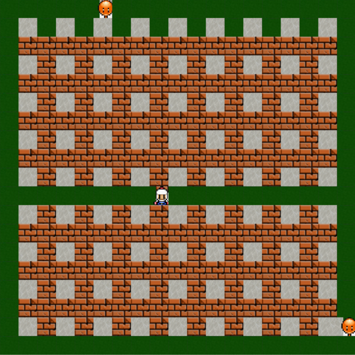

## BomberBUT




### Prérequis
- **Python 3.x**
- **Tkinter** 

### Lancer le jeu
Pour démarrer le jeu, exécutez la commande suivante :
```bash
python main.py
```

### Commandes de base
| Fonction         | Touche |
|------------------|--------|
| Déplacer à gauche| flèche gauche |
| Déplacer à droite| flèche droite |
| Déplacer en haut | flèche haut |
| Déplacer en bas  | flèche bas |
| Poser une bombe  | espace |

### Fonctionnalités
- Le joueur contrôle le personnage pour poser des bombes et détruire les murs cassables et les fantômes.
- Les bombes explosent après un certain délai et détruisent les éléments dans leur portée (murs cassables, fantômes).
- Les fantômes se déplacent aléatoirement sur la carte et peuvent attaquer le joueur.
- Victoire : détruire tous les murs cassables avant la fin du temps.
- Défaite : perdre tous les points de vie ou si le temps imparti s'écoule.

### Points de Vie (PV)
- Le joueur commence avec **3 PV**.
- Perte de PV :
  - Si le joueur reste sur la même case qu'une bombe lors de l'explosion : **-2 PV**.
  - Si le joueur est sur une case adjacente à l'explosion d'une bombe : **-1 PV**.
  - Si un fantôme attaque le joueur : **-1 PV**.

### Score
- Tuer un fantôme : **+10 points**.
- Détruire un mur cassable : **+1 point**.

### Auteurs
**ASSIF Maryam** et **ASSAL Manel**
